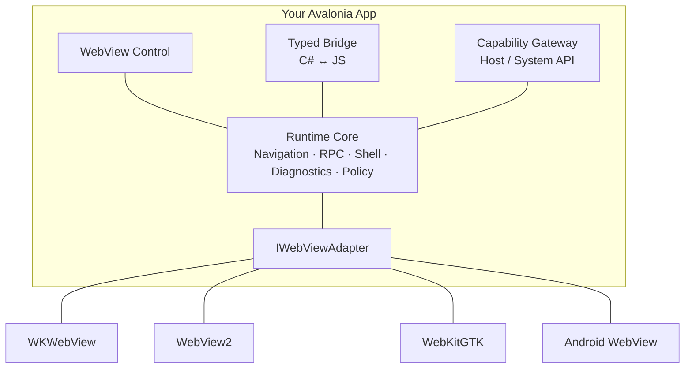

<h1 align="center">Fulora</h1>

<p align="center">
  <strong>Build desktop apps at web speed, without giving up native power.</strong><br/>
  <sub>A typed, policy-driven hybrid app platform for .NET and Avalonia.</sub>
</p>

<p align="center">
  
  
  <a href="https://github.com/AGIBuild/Agibuild.Fulora/actions/workflows/ci.yml"></a>
  
</p>

<p align="center">
  
  
  
  
  
</p>

<p align="center">
  
  
  
  
</p>

---

## Why Fulora

You have a fast-moving web team and a battle-tested .NET desktop stack.  
Most hybrid approaches force a compromise: either weak host-web contracts, or a rewrite when complexity grows.

Fulora is built for the middle path that scales:

- Keep your native host in C# and Avalonia
- Ship rich UI with React/Vue/Svelte inside WebView
- Connect both sides through a typed, source-generated bridge
- Enforce host capabilities through policy-first execution

From "just embed one page" to "run a full product shell", you stay on one runtime model.

---

## Start in 60 Seconds

Choose the onboarding path that matches where you are today.

**Recommended (CLI + template):**

```bash
dotnet tool install -g Agibuild.Fulora.Cli
dotnet new install Agibuild.Fulora.Templates
fulora new MyApp --frontend react
cd MyApp
fulora dev
```

**Alternative (template only):**

```bash
dotnet new install Agibuild.Fulora.Templates
dotnet new agibuild-hybrid -n MyApp
cd MyApp
dotnet run --project MyApp.Desktop
```

**Manual (add WebView to an existing Avalonia app):**

```bash
dotnet add package Agibuild.Fulora.Avalonia
```

In `Program.cs`:

```csharp
AppBuilder.Configure<App>()
    .UsePlatformDetect()
    .UseAgibuildWebView()
    .StartWithClassicDesktopLifetime(args);
```

In XAML:

```xml
<Window xmlns:wv="clr-namespace:Agibuild.Fulora;assembly=Agibuild.Fulora">
    <wv:WebView x:Name="WebView"
                Source="https://example.com" />
</Window>
```

Full guide: [Getting Started](docs/articles/getting-started.md) · [Documentation Index](docs/index.md)

---

## See It in Action

Explore what Fulora can do before diving into the docs.

- Product walkthrough: [Demo guide](docs/demo/index.md)
- AI workflow example: [AI Integration](docs/ai-integration-guide.md)
- End-to-end sample apps: [Demos & Samples](#demos--samples)

---

## Speak One Language Across C# and JavaScript

The bridge is the core experience: predictable contracts, async-friendly calls, and no fragile string-based IPC.

Expose C# to JavaScript:

```csharp
[JsExport]
public interface IGreeterService
{
    Task<string> Greet(string name);
}

webView.Bridge.Expose<IGreeterService>(new GreeterService());
```

Call from JavaScript:

```javascript
const msg = await window.agWebView.rpc.invoke("GreeterService.greet", {
    name: "World"
});
```

Call JavaScript from C#:

```csharp
[JsImport]
public interface INotificationService
{
    Task ShowNotification(string message);
}

var notifications = webView.Bridge.GetProxy<INotificationService>();
await notifications.ShowNotification("File saved!");
```

---

## Ship SPAs Like Native Screens

Run your frontend exactly how your team already works: embedded assets in production, hot reload in development.

**Production (embedded):**

```csharp
webView.EnableSpaHosting(new SpaHostingOptions
{
    EmbeddedResourcePrefix = "wwwroot",
    ResourceAssembly = typeof(MainWindow).Assembly,
});
await webView.NavigateAsync(new Uri("app://localhost/index.html"));
```

**Development (HMR):**

```csharp
webView.EnableSpaHosting(new SpaHostingOptions
{
    DevServerUrl = "http://localhost:5173"
});
```

---

## Demos & Samples

See complete patterns, not toy snippets.

| Sample | Description |
|--------|-------------|
| [samples/avalonia-react](samples/avalonia-react/) | Avalonia + React (Vite), typed bridge, SPA hosting |
| [samples/avalonia-ai-chat](samples/avalonia-ai-chat/) | AI chat with `IAsyncEnumerable` streaming, cancellation, Microsoft.Extensions.AI |
| [samples/showcase-todo](samples/showcase-todo/) | Full-featured reference app (plugins, shell, CLI) |

Walkthrough: [Demo guide](docs/demo/index.md) · [AI Integration](docs/ai-integration-guide.md)

---

## Capability Snapshot

From a single embedded page to a full product shell — everything you need is already here.

**Core**

- Typed bridge: `[JsExport]` / `[JsImport]`, source-generated C#/JS proxies, AOT-safe; V2: `byte[]`/`Uint8Array`, `CancellationToken`/`AbortSignal`, `IAsyncEnumerable` streaming, overloads
- Typed capability gateway for host/system operations (policy-first execution)
- SPA hosting: embedded assets, dev HMR proxy, shell activation, deep-link, SPA asset hot update with signature verification
- OAuth / Web auth (`IWebAuthBroker`), Web dialog (`IWebDialog`), screenshot & PDF, cookies, command manager
- DevTools, User-Agent, session modes, dependency injection

**Ecosystem**

- Official plugins: Database (SQLite), HTTP Client, File System, Notifications, Auth Token, Biometric, LocalStorage
- CLI: `fulora new`, `dev`, `generate`, `search`, `add plugin`, `list plugins --check`
- Telemetry: OpenTelemetry provider, Sentry crash reporting with bridge breadcrumbs
- AI: Microsoft.Extensions.AI integration, streaming, tool calling, Ollama/OpenAI providers
- Enterprise: OAuth PKCE client, shared state store (cross-WebView), plugin compatibility matrix

Details: [Architecture](docs/articles/architecture.md) · [Bridge guide](docs/articles/bridge-guide.md) · [SPA hosting](docs/articles/spa-hosting.md)

---

## Architecture at a Glance

One runtime core, multiple platform adapters.



---

## Vision & Roadmap

Fulora helps teams move from first WebView integration to full hybrid platform **without replacing their foundation**.

Two paths, one runtime:

- **Control path**: integrate WebView with minimal coupling
- **Framework path**: adopt bridge, policy, shell, and tooling for faster delivery

Unlike wrapper-only solutions, Fulora provides typed host/web contracts, policy-governed capabilities, machine-checkable diagnostics, and scalable app-shell patterns out of the box.

**Current status:** Phase 12 (Enterprise & Advanced Scenarios) completed. All roadmap phases through 12 are done.

[Full Roadmap](openspec/ROADMAP.md) · [Project Vision & Goals](openspec/PROJECT.md)

---

## Quality Signals

Quality badges at the top of the page are updated automatically by CI on every successful build to `main` from these CI gates:

```bash
nuke Test              # Unit + Integration
nuke Coverage          # Coverage report + threshold enforcement
nuke NugetPackageTest  # Pack → install → run smoke test
```

For local template validation (not required by the default CI badge pipeline):

```bash
nuke TemplateE2E       # Template end-to-end test
```

---

## License

[MIT](LICENSE.txt)
